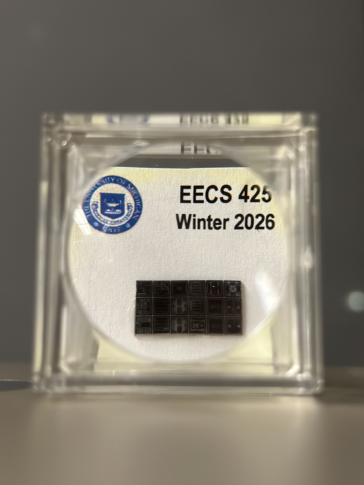
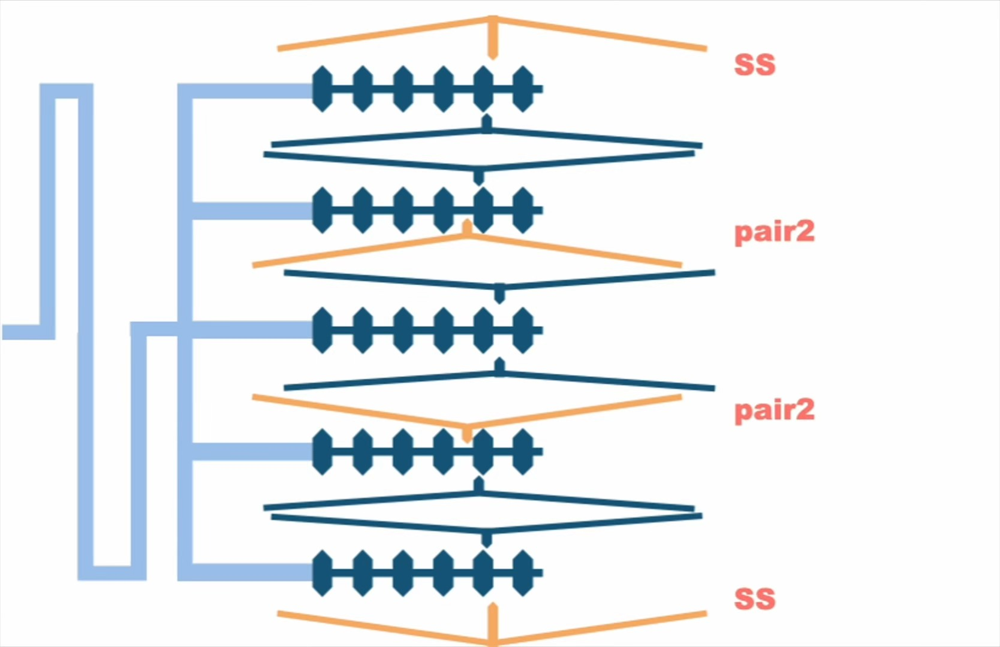
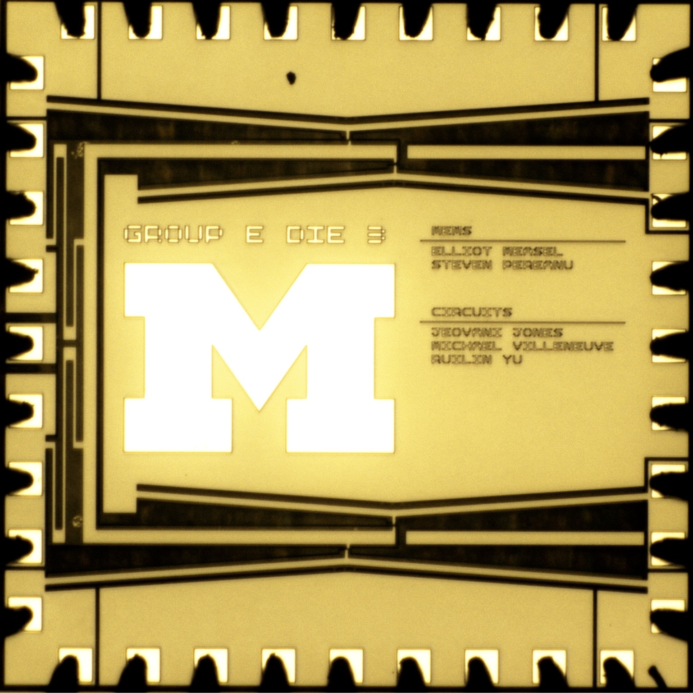
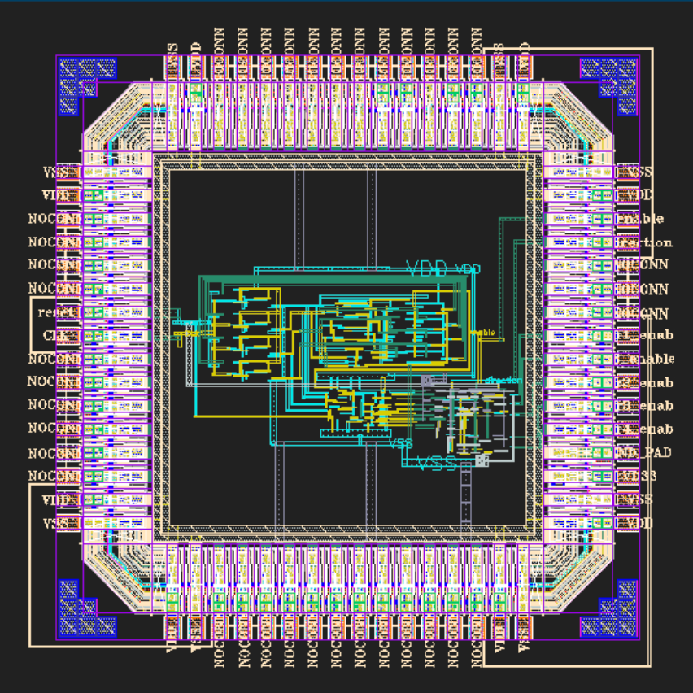
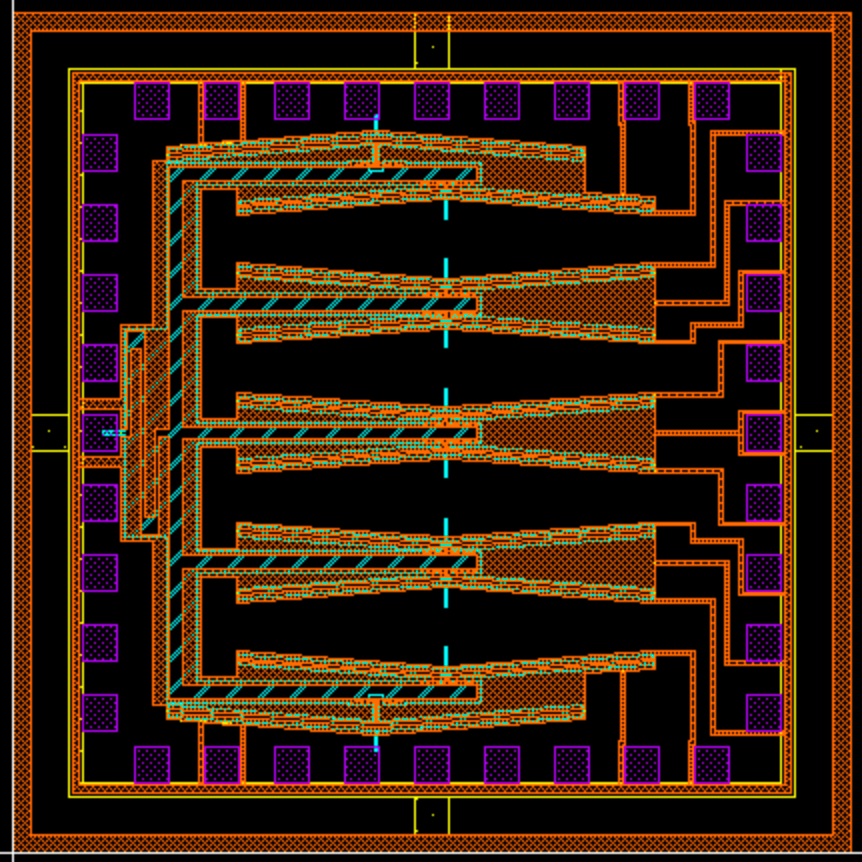

# Bidirectional Electrothermal Inchworm Actuator

This repository contains the design, simulation, fabrication, and testing artifacts for **Group E's EECS 425 Integrated Microsystems Laboratory project** at the University of Michigan (Winter 2026).

The project explores a bidirectional MEMS inchworm actuator that uses cascaded electrothermal stages to achieve and retain larger displacements than a conventional single-stage actuator. A custom control circuit sequences four actuator pairs and a save-state stage, allowing the central structure to move in either direction while minimizing steady-state power.

## Project gallery

<table>
  <tr>
    <td align="center" width="50%">
       
      <b>Packaged fabricated MEMS dies</b>
    </td>
    <td align="center" width="50%">
       
      <b>Multi-stage actuation principle</b>
    </td>
  </tr>
  <tr>
    <td align="center" width="50%">
       
      <b>Fabricated Group E die</b>
    </td>
    <td align="center" width="50%">
       
      <b>CMOS control chip layout</b>
    </td>
  </tr>
</table>

   
  <b>MEMS actuator layout</b>

## Project goals

- Demonstrate that multi-stage electrothermal actuation can produce useful lateral displacement.
- Investigate mechanical contact, friction, compression, wear, and thermal/electrical conduction at MEMS interfaces.
- Design and simulate the MEMS structure, control logic, and high-current actuator drivers.
- Fabricate and evaluate multiple device variants.

## Highlights

- Designed a compact device within a 2 mm × 2 mm footprint.
- Simulated the MEMS structure and thermal behavior in COMSOL Multiphysics.
- Developed the control system and driver circuitry in Cadence Virtuoso.
- Modeled full-system operation in Simulink.
- Fabricated and tested three die variants with different actuator widths and tooth geometries.
- Demonstrated two-stage engagement and approximately 5 µm of lateral motion on the most robust device variant, validating the core actuation concept.

## Repository structure

| Directory | Contents |
| --- | --- |
| `Cadence/Project/` | Circuit schematics, symbols, and test benches |
| `Comsol_designs/Full Designs/` | Final full-device COMSOL models and design variants |
| `SImulink/` | System-level models and block-diagram screenshots |
| `MEMS Final Design Files/` | Final GDS layouts |
| `Final presentation/` | Final report, presentation PDF, and selected demonstration media |

## Tools

- COMSOL Multiphysics
- Cadence Virtuoso
- MATLAB/Simulink
- GDS layout tools
- Microsoft PowerPoint, Word, and Excel

The native design files require the corresponding proprietary software and, in some cases, the process design kit used for the course. The PDFs, images, GIFs, and videos can be viewed without those tools.

## Key results

Testing showed that the electrothermal arms could achieve the intended displacement without the buckling predicted by early simulations. The first two device variants exposed challenges involving friction, vertical compliance, resistance variation, and available drive current. The third variant successfully translated sequential vertical actuator motion into lateral inchworm displacement, demonstrating the feasibility of the overall mechanism.

For the full analysis, calculations, test results, and proposed design improvements, see [`Final presentation/Final Report - Group E.pdf`](Final%20presentation/Final%20Report%20-%20Group%20E.pdf).

## Repository scope

This is a curated portfolio version of the project. It focuses on final deliverables and representative engineering artifacts rather than every revision, raw test recording, temporary simulation result, and course-administration document. The complete working archive is maintained separately by the team.

## Team

Ruilin Yu, on behalf of Group E.

## Academic context

This project was completed for **EECS 425 — Integrated Microsystems Laboratory** at the University of Michigan. The repository is provided for educational and archival purposes.
